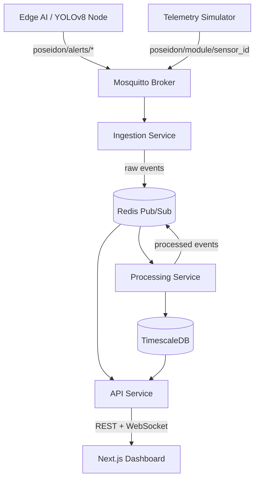

# Poseidon — Smart Water Management Hub

Poseidon is a production-oriented smart water operations platform for campuses, farms, and distributed water infrastructure. It combines MQTT ingestion, event-driven processing, TimescaleDB analytics, live WebSocket delivery, and an edge AI alert pipeline into a single dashboard.

## Architecture



## Updated folder structure

```text
poseidon/
├── backend/
│   ├── src/
│   │   ├── bin/
│   │   │   ├── api.js
│   │   │   ├── ingestion.js
│   │   │   ├── processing.js
│   │   │   └── simulator.js
│   │   ├── config/
│   │   │   └── env.js
│   │   ├── lib/
│   │   │   ├── logger.js
│   │   │   └── redisBus.js
│   │   ├── middleware/
│   │   │   ├── auth.js
│   │   │   ├── rateLimit.js
│   │   │   └── validate.js
│   │   ├── routes/
│   │   ├── services/
│   │   │   ├── apiService.js
│   │   │   ├── batchWriter.js
│   │   │   ├── ingestionService.js
│   │   │   ├── processingService.js
│   │   │   └── telemetrySimulator.js
│   │   └── validation/
│   ├── Dockerfile.api
│   ├── Dockerfile.ingestion
│   ├── Dockerfile.processing
│   └── Dockerfile.simulator
├── database/
│   ├── 01_schema.sql
│   └── 02_seed_data.sql
├── edge_ai/
│   ├── optical_sentry.py
│   ├── requirements.txt
│   └── Dockerfile
├── frontend/
│   ├── src/
│   │   ├── app/
│   │   ├── components/
│   │   ├── lib/
│   │   └── store/
│   └── Dockerfile
├── k8s/
│   └── poseidon.yaml
└── .github/
    └── workflows/
        └── ci-cd.yml
```

## Runtime model

### 1. Ingestion service
Consumes MQTT topics in the shape `poseidon/{module}/{sensor_id}` and forwards raw envelopes into Redis.

### 2. Processing service
Validates each module with shared JSON/Zod-style contracts, deduplicates via Redis, batches writes, and persists into TimescaleDB.

### 3. API service
Serves REST endpoints, exposes WebSocket fanout, and forwards processed events to the browser.

### 4. Frontend
Uses a shared WebSocket connection plus Zustand store for global live state, connection status, and recent alerts.

### 5. Edge AI
Supports real YOLOv8 inference when a model and stream are available, with simulation fallback for local/dev runs.

## Database design

The database stays compatible with the current dashboard while adding TimescaleDB hypertables, indexes, retention policies, and continuous aggregates.

Core tables:

- `Rainfall_Log`
- `Storage_Tanks`
- `Quality_Sensors`
- `Irrigation_Zones`
- `Overall_Usage`
- `Anomaly_Alerts`

Operational features:

- Hypertables on `timestamp`
- Composite timestamp/sensor indexes
- Retention policies for raw telemetry and alerts
- Continuous aggregates for daily and hourly summaries

## Key service snippets

### API service
```js
const { startApiService } = require('./services/apiService');

async function startServer() {
  const env = getEnv();
  return startApiService(env, logger);
}
```

### Processing service
```js
await batchWriter.enqueue(tableName, columns, row);
await redisBus.publish('poseidon:processed', {
  channel: 'usage',
  data: normalized,
});
```

### Edge AI payload
```python
payload = {
    "node_id": node_id,
    "sensor_id": node_id,
    "module": "alerts",
    "message_id": str(uuid4()),
    "timestamp": datetime.now(timezone.utc).isoformat(),
    "alert_type": alert_type,
}
```

### Frontend global store
```ts
export const usePoseidonStore = create<TelemetryState>((set) => ({
  wsStatus: 'connecting',
  alerts: [],
  ingestMessage: (message) => set((state) => ({ /* ... */ })),
}));
```

## Local development

### Prerequisites
- Node.js 20+
- Docker + Docker Compose v2
- Python 3.11+ for the edge node

### Start the full stack

```bash
npm run install:all
npm run dev:stack
```

Note: `dev:stack` now runs `docker compose up -d timescaledb redis mosquitto` first. Ensure Docker Desktop (engine) is running before starting.

This starts:
- telemetry simulator
- MQTT ingestion service
- Redis-backed processor
- API/WebSocket service
- Next.js dashboard
- optional edge AI simulator/inference node

### Docker Compose

```bash
docker compose up --build
```

The compose file now includes:
- TimescaleDB
- Redis
- Mosquitto
- simulator
- ingestion
- processing
- API
- frontend
- edge AI

## API reference

All list endpoints accept `?limit=N` with a maximum of 1000.

| Endpoint | Purpose |
|---|---|
| `GET /api/rainfall` | Rainfall readings |
| `GET /api/harvesting` | Storage tank readings |
| `GET /api/quality` | Water quality readings |
| `GET /api/agriculture` | Irrigation demand readings |
| `GET /api/usage` | Consumption totals |
| `GET /api/alerts` | Optical anomaly alerts |
| `POST /api/auth/login` | JWT token issuance |
| `GET /health` | Service health |

### Example

```bash
curl http://localhost:3001/api/usage?limit=10
```

## Testing

```bash
cd backend && npm test
cd frontend && npm test
cd edge_ai && pytest -q
```

## Deployment

- Kubernetes manifest: `k8s/poseidon.yaml`
- CI/CD workflow: `.github/workflows/ci-cd.yml`
- Container images are split per service so ingestion, processing, API, frontend, and edge AI can scale independently.
- GitHub Actions deploy requires a repository secret named `KUBE_CONFIG_DATA` containing a base64-encoded kubeconfig.
- On `main`, CI automatically builds and pushes required GHCR images (`backend-simulator`, `backend-ingestion`, `backend-processing`, `backend-api`, `frontend`) under `ghcr.io/<repo-owner>/...` before deployment.
- Image tags are hardened with branch/tag-aware labels plus immutable SHA tags.
- Deploy verifies required SHA-tagged GHCR images exist before `kubectl apply` so missing tags fail fast.
- Deploy runs in the GitHub `production` environment and pins workloads to immutable SHA images before rollout checks.
- The deploy job applies manifests and waits for rollout readiness across all Poseidon deployments before marking success.

## Security and scaling notes

- JWT auth is scaffolded and can be swapped for a real IdP later.
- RBAC is built into middleware and can be extended per route.
- Rate limiting is enabled by explicit production config.
- WebSocket delivery is Redis-backed so multiple API replicas can broadcast the same event stream.
- The processing service can be horizontally scaled because Redis deduplication prevents duplicate writes.
- TimescaleDB continuous aggregates keep dashboards fast without querying the full raw history.

## License

MIT
