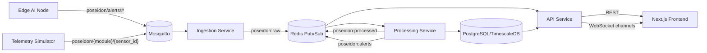
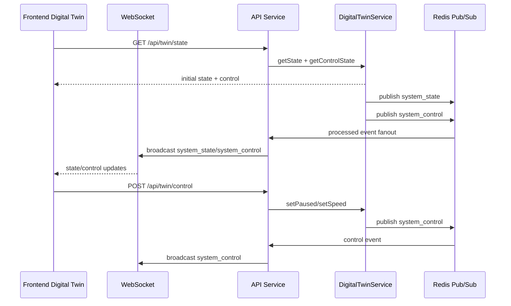

# Poseidon Smart Water Management Hub

Poseidon is a distributed smart water platform with a backend-authoritative digital twin. It combines MQTT ingestion, event-driven processing, PostgreSQL or TimescaleDB persistence, live WebSocket fanout, edge AI anomaly signals, a geospatial map, and a real-time 3D simulation interface.

## What changed

- Added backend-authoritative digital twin state and control flow.
- Added Digital Twin UI mode with:
  - Dashboard mode
  - Geospatial Map mode
  - 3D simulation mode
- Added deterministic simulation control APIs (play, pause, speed, event injection).
- Added synchronized channels for system state and control snapshots.

## Architecture overview



## Digital twin synchronization model



## Canonical state model

All map, 3D, and dashboard rendering derives from one shared shape:

```ts
type SystemState = {
  timestamp: number;
  temperatureC: number;
  rainfall: Record<string, { sensorId: string; mmPerHour: number; status: 'online' | 'offline' }>;
  tanks: Record<string, {
    id: string;
    name: string;
    capacityLiters: number;
    volumeLiters: number;
    catchmentAreaM2: number;
    efficiency: number;
    irrigationOutflowLps: number;
    usageOutflowLps: number;
    failure: boolean;
  }>;
  soil: Record<string, {
    zoneId: string;
    moisturePct: number;
    absorptionRate: number;
    evaporationRate: number;
    irrigationUsageLps: number;
  }>;
  usage: Record<string, {
    zoneId: string;
    municipalLiters: number;
    harvestedLiters: number;
    totalLiters: number;
  }>;
  alerts: Array<{
    id: string;
    timestamp: number;
    severity: 'info' | 'warning' | 'critical';
    sourceId: string;
    message: string;
  }>;
};
```

## Project layout

```text
.
├── backend/
│   ├── src/
│   │   ├── bin/
│   │   ├── config/
│   │   ├── lib/
│   │   ├── middleware/
│   │   ├── routes/
│   │   └── services/
│   ├── Dockerfile.api
│   ├── Dockerfile.ingestion
│   ├── Dockerfile.processing
│   └── Dockerfile.simulator
├── frontend/
│   ├── src/
│   │   ├── app/
│   │   ├── simulation/
│   │   ├── map/
│   │   ├── 3d/
│   │   ├── store/
│   │   └── lib/
│   └── Dockerfile
├── database/
├── edge_ai/
├── mosquitto/
├── k8s/
└── docker-compose.yml
```

## Core runtime services

- Simulator: Publishes synthetic telemetry to MQTT topics.

- Ingestion: Subscribes to MQTT topics and pushes raw events into Redis.

- Processing: Validates and normalizes events, deduplicates by message ID, batches writes to DB, and publishes processed channels for API fanout.

- API service: Serves REST endpoints, hosts WebSocket fanout, and hosts backend digital twin engine and control endpoints.

- Frontend: Uses one Zustand store for live state and supports Dashboard, Map, and 3D modes with synchronized selection and control.

## WebSocket channels

- rainfall
- tanks
- quality
- irrigation
- usage
- alerts
- system_state
- system_control

## REST API reference

All list endpoints accept limit query params (max capped by service logic).

| Endpoint | Method | Description |
| --- | --- | --- |
| /api/rainfall | GET | Rainfall readings |
| /api/harvesting | GET | Tank and harvesting readings |
| /api/quality | GET | Water quality readings |
| /api/agriculture | GET | Irrigation and soil readings |
| /api/usage | GET | Water usage readings |
| /api/alerts | GET | Anomaly alerts |
| /api/twin/state | GET | Current digital twin state and control |
| /api/twin/control | POST | Twin control action (play, pause, speed) |
| /api/twin/event | POST | Inject simulation event |
| /api/auth/login | POST | Login/token endpoint |
| /health | GET | Service health |

### Twin control payloads

Play:

```json
{ "action": "play" }
```

Pause:

```json
{ "action": "pause" }
```

Speed:

```json
{ "action": "speed", "speed": 2 }
```

### Twin event payloads

```json
{ "type": "RAIN_SPIKE", "intensity": 8 }
```

```json
{ "type": "TANK_FAILURE", "tankId": "T1" }
```

```json
{ "type": "SENSOR_OFFLINE", "sensorId": "S2" }
```

```json
{ "type": "PIPE_LEAK", "location": { "lng": 72.8799, "lat": 19.0779 } }
```

## Local development

### Prerequisites

- Node.js 20+
- npm 9+
- Docker Desktop with Compose v2
- Python 3.11+ (for edge_ai local runs)

### Install dependencies

```bash
npm run install:all
```

### Start full local stack

```bash
npm run dev:stack
```

This command:

- Frees occupied ports (3000, 3001, 8080)
- Starts infra (TimescaleDB, Redis, Mosquitto)
- Runs migration job
- Starts simulator, ingestion, processing, API, frontend, and edge AI

### Start only API and frontend

```bash
npm run dev
```

### Docker compose option

```bash
docker compose up --build
```

## Frontend environment

Create or update frontend/.env.local:

```env
NEXT_PUBLIC_API_URL=http://localhost:3001
NEXT_PUBLIC_WS_URL=ws://localhost:3001
NEXT_PUBLIC_MAPBOX_TOKEN=your_mapbox_access_token
```

If NEXT_PUBLIC_MAPBOX_TOKEN is missing, Map mode shows a token warning panel and continues functioning in dashboard and 3D modes.

## Testing and validation

Run backend tests:

```bash
cd backend
npm test
```

Run frontend lint and tests:

```bash
cd frontend
npm run lint
npm test
```

Run edge AI tests:

```bash
cd edge_ai
pytest -q
```

## Deployment notes

- Kubernetes manifests are in k8s/poseidon.yaml.
- CI workflow is in .github/workflows/.
- Services are split into separate images for horizontal scaling.
- API can scale horizontally with Redis-backed event fanout.
- Processing can scale with dedupe guardrails for message ID safety.

## Security and operations

- Helmet and rate limiting enabled in API middleware.
- JWT auth scaffolded for protected API use cases.
- Structured logging with pino/pino-http.
- Redis-based pub/sub and dedupe for distributed processing consistency.
- Backend-authoritative twin control to avoid client divergence.

## License

MIT
